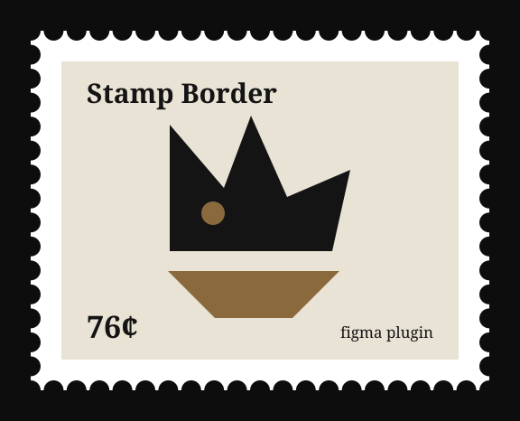

# Stamp Border

A Figma plugin that wraps any frame in a perforated postage-stamp edge.



Select a frame, run the plugin, drag the sliders. The perforation is a real
boolean-subtracted vector shape, so it scales, recolors and exports like any
other Figma layer.

## Install

No build step — plain JS, no dependencies.

1. Clone this repo.
2. Figma desktop → **Plugins → Development → Import plugin from manifest…**
3. Pick `manifest.json`.

## Use

Select a frame and run **Plugins → Development → Stamp Border**.

| Control | What it does |
| --- | --- |
| Padding | Paper margin around your frame |
| Perf size | Radius of each perforation bite |
| Perf spacing | Distance between perforation centers |
| Corner | Corner radius of the paper |
| Fill | Paper color of the stamp |
| Shadow | Soft drop shadow under the paper |

The panel previews your actual selection — it takes the frame's real proportions
and reports the finished size and perforation count as you drag.

Re-running on an already-stamped frame re-cuts it in place instead of nesting
another border, so you can drag the sliders and watch the canvas update. The
result is a group named `Stamp Border` holding three layers — the `Perforation`
mask, the `Paper` it cuts, and a `Content` group wrapping your original frame.
Your frame is never altered; **Remove stamp** gives it back on its own.

At zero padding the paper is exactly the size of your frame, so the perforation
bites into the frame's own artwork. Raise the padding and the bites move out
into the paper margin instead.

Each stamp remembers its own settings. Select a frame you stamped earlier and
the sliders land back on the values you used, with a dot next to the frame name
to say so — so you can come back a week later and nudge the perf size without
guessing what it was. A frame you've never stamped starts from whatever you used
last.

Dragging a control only redraws the panel preview. The canvas changes when you
press **Apply to selection** — nothing edits your document behind your back, and
one apply is one undo step. **Remove stamp** gives the frame back on its own and
forgets its saved settings. **Reset settings** returns the controls to the
defaults without touching the canvas.

## How it works

`code.js` builds a rectangle the size of your frame plus padding, scatters
ellipses along its four edges, and boolean-subtracts them into a single shape.

That shape is then set as a **mask**. A Figma mask clips every sibling above it,
so stacking it under the paper and the content gives both the perforated
silhouette — which is the only way the holes can cut the frame itself once the
padding reaches zero. A mask's own paint doesn't render, so the visible paper is
a separate plain rect between the mask and the content, and the drop shadow
lives on the group (a mask's effects don't render either, and on the group it
traces the perforated edge rather than a plain rectangle).

**A Figma mask does not reach inside a frame that clips its content.** Mask a
frame directly and it renders uncut, while an otherwise identical rectangle
sibling cuts correctly — so zero padding appeared to do nothing at all. Wrapping
the frame in a plain group and masking the group works, which is what the
`Content` layer is for. Setting the frame's `clipsContent` to `false` also
works, but that changes the user's frame; the wrapper doesn't touch it.

The pieces `build()` makes are tagged with `setPluginData('role', …)`, so
re-running finds the user's frame as the one child without a role — more durable
than matching on layer type or name, both of which a user can change.

Hole centers land on every step along each edge (`x0 + i * width / n`), corners
included — like a real perforated stamp, a corner hole belongs to both edges at
once, and offsetting them inward instead strands a sliver of paper at each
corner. Every edge mirrors around its midpoint. That's the only non-obvious
math, and it's what `check.js` covers.

Settings are stored with `setPluginData` on the frame rather than on the wrapper
group, so they survive a rebuild, an ungroup and a duplicate. The panel only
adopts reported settings when the selection moves to a different frame — every
apply echoes a selection back, and swallowing that is what keeps a mid-drag
rebuild from yanking the slider out from under the cursor.

Re-running has to re-cut in place rather than stack a second stamp, so it lifts
the frame out of its old group and takes the stale perforation with it — the
group holds the perforation too, so it won't disappear on its own. Dragging a
slider fires a run of applies, and `check-rebuild.js` drives `code.js` against a
stub of the Figma node API to assert that run still leaves exactly one group.

```bash
node check.js
node check-rebuild.js
```

## Files

| File | |
| --- | --- |
| `manifest.json` | Figma plugin manifest |
| `code.js` | Plugin sandbox — geometry and node creation |
| `ui.html` | Panel UI with live SVG preview |
| `check.js` | Geometry assertions |
| `check-rebuild.js` | Rebuild assertions, against a stub Figma API |
| `docs/gen-preview.js` | Regenerates the image at the top of this README |

## License

MIT
